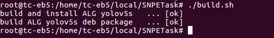

# SNPETask

[](https://github.com/gesanqiu)[](https://github.com/gesanqiu/SNPE_Tutorial)

欢迎各位star/fork本repo并进行学习交流。

## Overview


上图源自Snapdragon Neural Processing Engine SDK Reference Guide，它展示了一个Deep Learning Neural Network在SNPE环境下的Workflow。本repo主要关注Workflow中的第二个阶段，当你拥有一个预训练模型（以`yolov5s.onnx`为例），如何从Model Convert到SNPE Enabled App，如官方教程所言，主要有以下四个步骤：

- [Model Convert](./doc/ModelConvert.md)：把`.tf/.tflite/.onnx/caffe/caffe2/.pt`等网络预训练模型转换为一个能够被SNPE加载的DLC文件。
- [Benchmark](./doc/Benchmark.md)：量化模型，以便能在Hexagon DSP上运行（可选项）。 
- [SNPETask](./doc/SNPETask.md)：使用SNPE runtime加载模型并完成推理。
- [YOLOv5s](./doc/YOLOv5s.md)：Pre-process（处理输入）和Post-process（处理输出）。

## File Tree

```shell
root@tc-eb5:/home/tc-eb5/local/SNPETask# tree
.
├── CMakeLists.txt
├── LICENSE
├── README.md
├── build.sh                  # Build Script
├── doc                       # Tutorials
│   ├── Benchmark.md
│   ├── FAQ.md
│   ├── ModelConvert.md
│   ├── SNPETask.md
│   └── YOLOv5s.md
├── lib                       # ELF of YOLOv5s SDK.
│   └── libYOLOv5s.so
├── model
│   ├── yolov5s.dlc
│   └── yolov5s_labels.txt
├── snpetask                  # SNPE runtime SDK source codes.
│   ├── SNPETask.cpp
│   └── SNPETask.h
├── test                      # Test program.
│   ├── main.cpp
│   ├── orange.jpeg
│   └── people.jpg
├── utility
│   ├── Logger.h              # Singleton logger based on spdlog library.
│   └── utils.h
└── yolov5s                   # YOLOv5s Inference SDK source codes.
    ├── CMakeLists.txt
    ├── inc
    │   ├── YOLOv5s.h
    │   └── YOLOv5sImpl.h
    ├── src
    │   ├── YOLOv5s.cpp
    │   └── YOLOv5sImpl.cpp
    └── yolov5s.json
```

## Prerequisites

- 开发平台：Qualcomm® QRB5165 (Linux-Ubuntu 18.04)
- 图形界面：Weston(Wayland)
- 开发框架：Gstreamer-1.14.5，OpenCV-4.5.5
- 算法引擎：snpe-1.61.0.3358
- 算法示例模型：YOLOv5s.onnx
- 第三方库：gflags，json-glib-1.0，glib-2.0，spdlog-1.10.0
- 构建工具：CMake-3.10.2
- 打包工具：checkinstall-1.6.2

```shell
# SNPE Runtime Library需要用户从官方链接下载并放到开发板指定目录
# CMake/OpenCV/spdlog需要用户编译安装
# yolov5s.onnx预训练模型可以从官方repo通过export.py获取，详细流程请阅读：./doc/ModelConvert.md
# 其余依赖可以使用apt-get install安装
sudo apt-get install libjson-glib-dev libgflags-dev
```

## Build & Compile

项目使用`CMakeLists.txt`进行构建和包管理，并提供了`build.sh`脚本用于构建整个项目（包含`alg`），运行成功将输出如下log：



假如编译失败则会输出`[failed]`，相应的build deb package也会失败。

`build`目录下将包含如下信息，相关.so文件会被重定向到`${CMAKE_SOURCE_DIR}/lib`目录：


其中`test-yolov5`为测试程序，`alg-yolov5s-01-linux_2.0-rel_arm64.deb`为`checkinstall`追踪make install生成的deb安装包。

`alg-yolov5s-01-linux_2.0-rel_arm64.deb`可以直接使用`dpkg - i`命令安装，内含YOLOV5S SDK和AIRunner ALG两部分内容，均被安装至`/opt/thundersoft/`目录下，详细安装路径可以参考`CMakeLists.txt`中的install语句。

## Run Test Program

测试程序`test-yolov5`使用gflags库进行命令行参数解析，可配置的参数及默认值如下：

```shell
Flags from /home/tc-eb5/local/SNPE_Tutorial/test/main.cpp:
    -confidence (Confidence Threshold.) type: double default: 0.5
    -config_path (Model config file path.) type: string
      default: "./yolov5s.json"
    -input (Input image file for this test program.) type: string
      default: "./image.jpg"
    -labels (Labels file for the yolov5s model.) type: string
      default: "./labels.txt"
    -nms (NMS Threshold.) type: double default: 0.5
```

测试程序将根据用户运行参数来初始化YOLOV5S Inference SDK对象并对输入图像进行推理，以下是在`build`目录下的一个运行样例：

```shell
./test-yolov5 --input ../test/people.jpg --labels ../model/yolov5s_labels.txt --config_path ../yolov5s/yolov5s.json
```

上述命令以`test`目录下的`people.jpg`为待检测图片，使用`model`目录下的`yolov5s_labels.txt`作为模型类别输入，`yolov5s`目录下的`yolov5s.json`作为模型配置文件。

`yolov5s.json`为模型的一些基础描述信息，包括模型路径，推理runtime，输出结果的格式，输入输出层名称。这些内容都与模型强相关，在`yolov5s/YOLOv5s.cpp`的实现中，我把这一系列可配置的参数都开放出来了，以此增加代码对不同模型的适配能力。

```json
{
    "model-path":"../model/yolov5s.dlc",
    "runtime":"CPU",
    "labels":85,
    "grids":25200,
    "input-layers":[
        "images"
    ],
    "output-layers":[
        "Sigmoid_199",
        "Sigmoid_201",
        "Sigmoid_203"
    ],
    "output-tensors":[
        "output",
        "329",
        "331"
    ]
}
```


