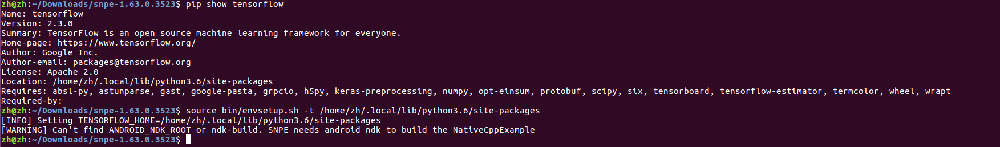
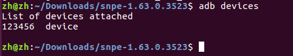
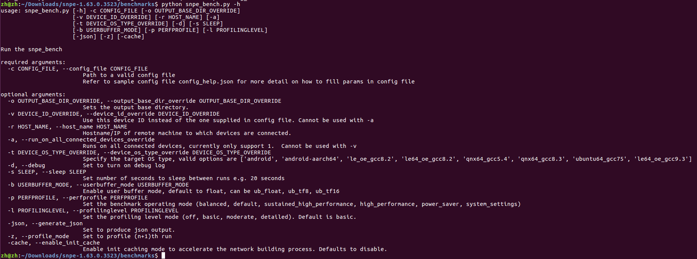
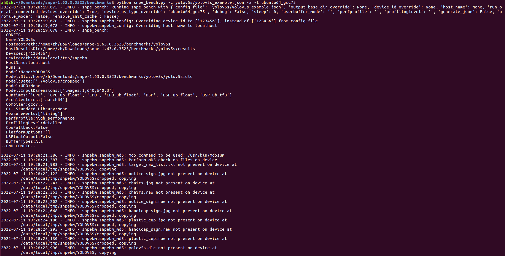

<!--
 * @Description: A simple benchmark records.
 * @version: 1.0
 * @Author: Ricardo Lu<shenglu1202@163.com>
 * @Date: 2022-07-09 11:35:30
 * @LastEditors: Ricardo Lu
 * @LastEditTime: 2022-07-11 20:09:15
-->
# Benchmark of YOLOv5

SNPE Reference Guide提供了[**Benchmarking**](https://developer.qualcomm.com/sites/default/files/docs/snpe/benchmarking.html)教程，以下内容只是教程的复现。

注：以下内均在HOST PC上完成，与开发板的通信依赖于adb工具，因此用户进行benchmark前需要确保开发板能够被adb server访问到。

## Setup

要使用SNPE提供的benchmark脚本，确保遵循[SNPE Setup](https://developer.qualcomm.com/sites/default/files/docs/snpe/setup.html)配置好了SNPE环境：



## yolov5s_example.json

**Benchmark**的输入是一个`.json`格式的配置文件，**SNPE**提供了一个配置文件的示例`alexnet_sample.json`，

`config_help.json`中解释了配置文件各个参数的含义，用户可以参考它来获取更多关于配置文件的信息，这里提供一个适用于本repo中`yolov5s.dlc`模型的benchmark配置文件模板：

```json
{
    "Name":"YOLOv5s",
    "HostRootPath": "yolov5s",
    "HostResultsDir":"yolov5s/results",
    "DevicePath":"/data/local/tmp/snpebm",
    "Devices":["123456"],
    "HostName": "localhost",
    "Runs":2,

    "Model": {
        "Name": "YOLOV5S",
        "Dlc": "./yolov5s/yolov5s.dlc",
        "InputList": "./yolov5s/target_raw_list.txt",
        "Data": [
            "./yolov5s/cropped"
        ]
    },

    "Runtimes":["GPU", "CPU", "DSP"],
    "Measurements": ["timing"],
    "ProfilingLevel": "detailed"

 }

```

通常使用默认配置项即可，需要关注的是`"Devices":[123456]`，用户可以通过`adb devices`获取设备号：



## Benchmark

在运行benchmark之前用户需要准备好benchmark需要的测试集数据，数据格式为与`snpe-net-run`一致的`.raw`格式，`./benckmark/yolov5s/create_raw.py`脚本可以用于生成测试需要的`.raw`数据：

```shell
zh@zh:~/Downloads$ python create_raw.py --help
usage: create_raw.py [-h] -d DEST [-g: HEIGHT] [-w WIDTH] -i IMG_FOLDER [-r RESIZE_TYPE]

Batch convert jpgs

optional arguments:
  -h, --help            show this help message and exit
  -d DEST, --dest DEST
  -g: HEIGHT, --height HEIGHT
  -w WIDTH, --width WIDTH
  -i IMG_FOLDER, --img_folder IMG_FOLDER
  -r RESIZE_TYPE, --resize_type RESIZE_TYPE
                        Select image resize type antialias or bilinear. Image resize type should match resize type used on images with which model was trained, otherwise there may be impact on model
                        accuracy measurement. (default: bilinear)
zh@zh:~/Downloads$ python create_raw.py -i test_img/test_640/ -d test_img/test_640/ -w 640 -g 640
```

运行如上命令，脚本会读取`test_img/test_640`目录下的所有`.jpg`图片并将其转化成640x640尺寸的`.raw`文件。然后需要生成一个`target_raw_list.txt`，里存储的是测试用`.raw`文件的相对路径。

然输入数据准备完成之后就能够运行`snpe_bench.py`来进行benchmark测试，以下是该脚本的所有参数，用户可以使用`-h`参数来获取更多关于参数的信息。

> snpe_bench.py [-h] -c CONFIG_FILE [-o OUTPUT_BASE_DIR_OVERRIDE]
>           			 [-v DEVICE_ID_OVERRIDE] [-r HOST_NAME] [-a]
>           			 [-t DEVICE_OS_TYPE_OVERRIDE] [-d] [-s SLEEP]
>           			 [-b USERBUFFER_MODE] [-p PERFPROFILE] [-l PROFILINGLEVEL]
>            			[-json] [-cache]

注意：参数的可选值将随着**SNPE**版本的更新而发生变换，因此建议每次使用前使用`-h`参数查看当前版本的参数。 `snpe-1.63.0.3523` 的参数如下图：



用户可以将`benchmark/yolov5s`整个目录拷贝至HOST PC的`${SNPE_ROOT}/benchmark`目录下然后运行`snpe_bench.py`脚本：

```shell
python snpe_bench.py -c alexnet_sample.json -a -t ubuntu64_gcc7.5
```

- `-a`：自动指定运行benchmark的设备为当前连接的设备，防止配置文件中没有配置而运行出错
- `-t`：目标设备平台

配置完成之后输出的log如下图，如果你是第一次在目标设备上运行**Benchmark**，那么脚本将会通过adb tool将所有需要的文件push到设备中：



**Benchmark**运行完成之后，运行结果将保存在配置文件 `HostResultDir`参数所指定的目录中，并且会对结果目录添加运行时间戳用于区分。

```shell
# In alexnet_sample.json, "HostResultDir" is set to "alexnet/results"
cd $SNPE_ROOT/benchmarks/alexnet/results
# Notice the time stamped directories and the "latest_results" link.
cd $SNPE_ROOT/benchmarks/alexnet/results/latest_results
# Notice the .csv file, open this file in a csv viewer (Excel, LibreOffice Calc)
# Notice the .json file, open the file with any text editor
```

`.csv`文件各字段的含义可以在[官网](https://developer.qualcomm.com/docs/snpe/benchmarking.html)中获得。

注：`./benchmark/yolov5s/results`目录下存放的是我进行的4张输入图片，两轮benchmark的测试结果，仅供参考。