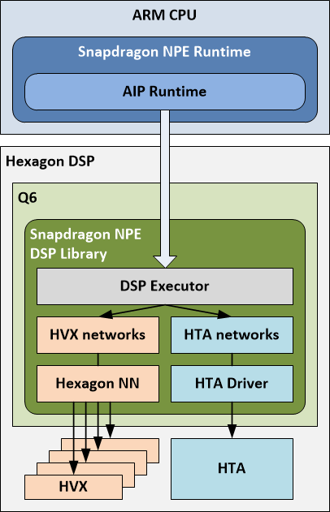
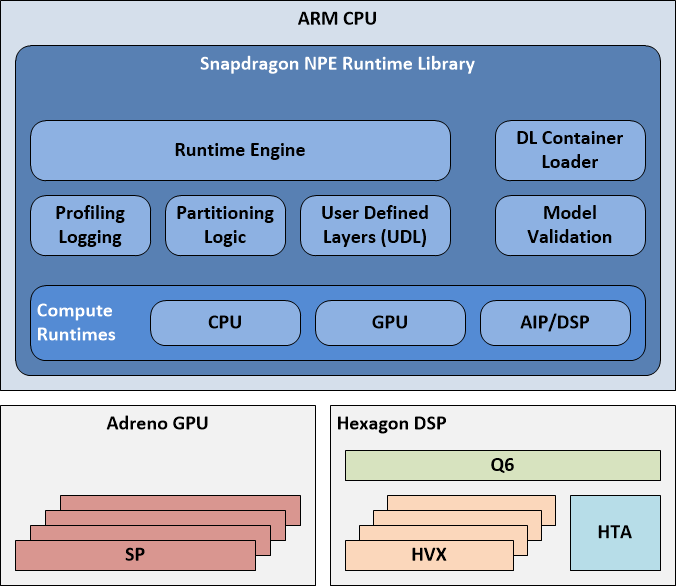

<!--
 * @Description: FAQ of this repository.
 * @version: 2.0
 * @Author: Ricardo Lu<shenglu1202@163.com>
 * @Date: 2022-07-09 11:52:17
 * @LastEditors: Ricardo Lu
 * @LastEditTime: 2022-07-11 20:09:25
-->
## FAQ 

### SNPE的Runtime 

**CPU** **Runtime** Runs the model on the CPU; supports 32-bit floating point or 8-bit quantized execution. 

**GPU** **Runtime** Runs the model on the GPU; supports hybrid or full 16-bit floating point modes. 

**DSP Runtime** Runs the model on Hexagon DSP using Q6 and Hexagon NN, executing on HVX; supports 8-bit quantized execution. 

**AIP Runtime** Runs the model on Hexagon DSP using Q6, Hexagon NN, and HTA; supports 8-bit quantized execution. 

### Partition Logic 

SNPE在运算时(不是加载模型时)，根据runtime将模型分为若干个子网络，然后各个子网络将运行支持它的device上。 

上图展示了一个AIP Subnet内含四个Subnets的情况，这四个subnets有两个HNN Subnets，两个HTA Subnets，在指定AIP Runtime的时候，实际上只有HTA Subnets会运行在HTA(AIP)上，另外两个HNN Subnets会运行在HVX(DSP)上。 

### DSP & AIP 

 

 

从上面两张图我们可以知道SNPE的软件架构和Hexagon DSP的硬件架构，实际DSP和AIP都属于cDSP，而AIP实际是Q6、HVX、HTA三者的软件抽象，其中HVX Cores对应着DSP Runtime，HTA Core对应着AIP Runtime。我们知道SNPE有分区逻辑，实际这个分区逻辑主要就是为AIP Runtime服务的，它把某些AIP(DSP)不支持的算子fullback回CPU上运行。 

### Choosing Between a Quantized or Non- Quantize Model 

量化与否主要影响三个方面：模型大小、模型初始化、准确度。 

在选择模型时我们也应该从这三个方面去做平衡： 

- 模型大小影响的是推理耗时； 
- 模型初始化是因为不同的runtime能处理的数据类型有限，假如说quantized模型跑在CPU上，在初始化时，SNPE首先会解量化，把原本uint8的数据转为float32再做推理，而解量化这一过程会增加模型加载和初始化的时间； 
- quantize/de-quantize均会带来运算精度上的损失。 

### Quantization algorithm 

有兴趣的可以阅读[Quantize vs Non-quantized](https://developer.qualcomm.com/sites/default/files/docs/snpe/quantized_models.html)中的Quantization Algorithm一节。 

需要注意的是在做模型量化时，通常需要为模型的每个label准备几张(通常100张左右)不属于训练集且具有代表性(区分度足够大)的输入数据，以获得更好的量化效果。 

### Batch 

量化模型的batch size必须为1，但是可以在构建SNPE实例是通过[setInputDimensions()](https://developer.qualcomm.com/sites/default/files/docs/snpe/group__c__plus__plus__apis.html#abb432cbbc740c42ea942d886b9c1c53e)动态resize输入尺寸。

