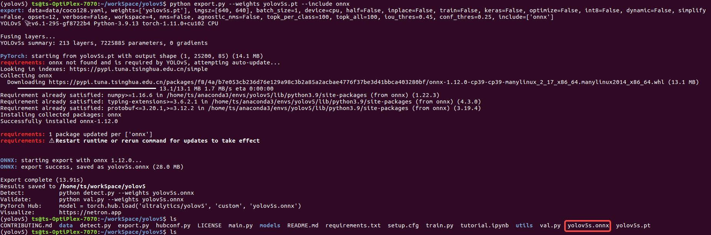
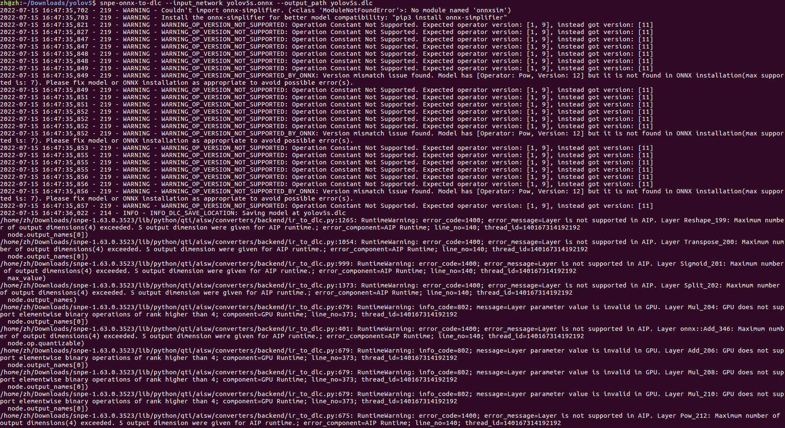
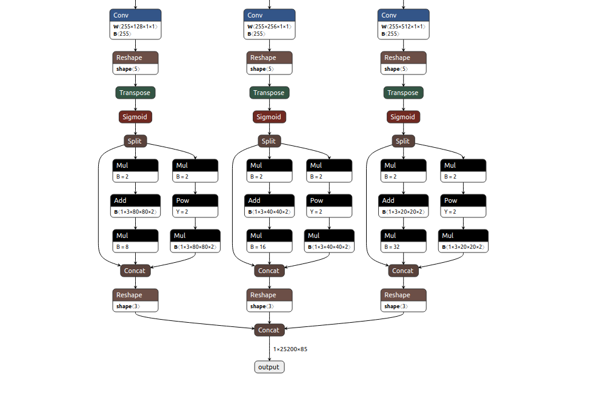
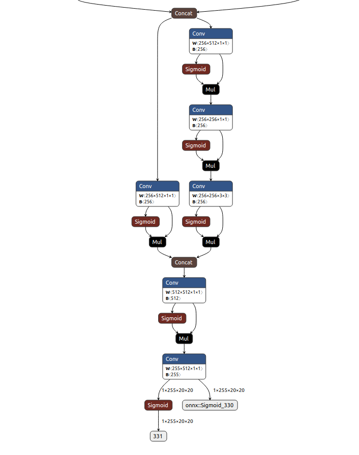
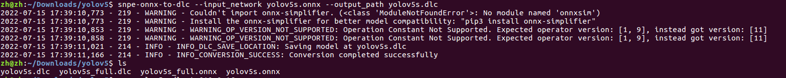

<!--
 * @Description: A tutorial of how to convert an onnx format model(YOLOv5s) to dlc.
 * @version: 2.0
 * @Author: Ricardo Lu<shenglu1202@163.com>
 * @Date: 2022-07-09 11:35:13
 * @LastEditors: Ricardo Lu
 * @LastEditTime: 2022-07-11 20:09:31
-->
# Model Convert

【注】：模型转换在x86 PC上进行。

模型转换本身并不复杂，因为模型本身只代表一系列运算(算子Ops)，但是不同的框架(也可以说是不同的硬件平台所导致的)使用了不同的规范和实现，在各个框架之间做模型转换，通常会借助ONNX(Open Neural Network Exchange)这一规范来完成。 

```Shell
snpe-onnx-to-dlc --input_network models/bvlc_alexnet/bvlc_alexnet/model.onnx
                 --output_path bvlc_alexnet.dlc
```

SNPE将onnx模型转换为dlc的命令很简单，转换失败最主要的原因就是算子不支持，这个需要自行去一层一层网络进行排查，转换失败的log也会给出一些提示。 

注：SNPE支持的ONNX算子可以在[Support ONNX Ops](https://developer.qualcomm.com/sites/default/files/docs/snpe/supported_onnx_ops.html)中查到。

注：SNPE支持的网络层可以在[Supported Network Layers](https://developer.qualcomm.com/sites/default/files/docs/snpe/network_layers.html)中查到。

## Convert YOLOv5s.onnx

基于pytorch hub，yolov5不同格式的模型导出可以参考官方教程：[TFLite, ONNX, CoreML, TensorRT Export](https://github.com/ultralytics/yolov5/issues/251)，以下内容基于用户配置好了yolov5官方要求的环境进行。

- yolov5s.pt导出成yolov5s.onnx

```shell
python export.py --weights yolov5s.pt --include onnx
```



注：首次运行时会自动帮用户安装onnx package。

- yolov5s.onnx转成yolov5s.dlc

```shell
# 运行如下命令前需要确保SNPE环境配置正常
# source ${SNPE_ROOT}/bin/envsetup.sh -o ${ONNX_PACKAGE_DIR}
snpe-onnx-to-dlc --input_network yolov5s.onnx --output_path yolov5s.dlc
```

假如使用官方的预训练模型，在转dlc时会有一系列WARNING日志输出：



1. WARNING_OP_VERSION_NOT_SUPPORTED：可以忽略

2. RuntimeWarning：error_message=Layer is not supported in AIP：可以忽略。

   Log输出为AIP Runtime不支持`Reshape_199`，`Transpose_200`等layers，原因是AIP只支持4-dimension的输入输出数据，而`Reshape_199`等layers的尺寸为5-dimensions，但如[SNPETask](./SNPETask.md)中`setCPUFallbackMode()`章节所言，runtime不支持的layers会被fullback到CPU上运行，因此并不会影响前向推理。

使用netron解析导出的onnx模型，可以看到这些不支持的layers为前向推理的后处理部分：

   

主要是将`1x80x80x255`，`1x40x40x255`，`1x20x20x255`的三个输出层数据reshape并且concat到一个`1x25200x85`的layer中，这部分工作我们可以在后处理中自行完成，因此假如想要去掉这部分WARNING提示，我们可以修改`${YOLOV5_ROOT}/model/yolo.py`中的`forward(self, x)`函数（第54-74行）为：

```Python
        def forward(self, x):
        z = []  # inference output
        for i in range(self.nl):
            x[i] = self.m[i](x[i])  # conv
            bs, _, ny, nx = x[i].shape  # x(bs,255,20,20) to x(bs,3,20,20,85)
            # x[i] = x[i].view(bs, self.na, self.no, ny, nx).permute(0, 1, 3, 4, 2).contiguous()

            if not self.training:  # inference
                # if self.onnx_dynamic or self.grid[i].shape[2:4] != x[i].shape[2:4]:
                #     self.grid[i], self.anchor_grid[i] = self._make_grid(nx, ny, i)

                y = x[i].sigmoid()
                # if self.inplace:
                #     y[..., 0:2] = (y[..., 0:2] * 2 + self.grid[i]) * self.stride[i]  # xy
                #     y[..., 2:4] = (y[..., 2:4] * 2) ** 2 * self.anchor_grid[i]  # wh
                # else:  # for YOLOv5 on AWS Inferentia https://github.com/ultralytics/yolov5/pull/2953
                #     xy, wh, conf = y.split((2, 2, self.nc + 1), 4)  # y.tensor_split((2, 4, 5), 4)  # torch 1.8.0
                #     xy = (xy * 2 + self.grid[i]) * self.stride[i]  # xy
                #     wh = (wh * 2) ** 2 * self.anchor_grid[i]  # wh
                #     y = torch.cat((xy, wh, conf), 4)
                # z.append(y.view(bs, -1, self.no))
                z.append(y)

        # return x if self.training else (torch.cat(z, 1),) if self.export else (torch.cat(z, 1), x)
        z.append(x)
        return z
```

这时候再导出的onnx模型就去掉了，再次使用netron可以看到模型的输出层发生了变化：



转dlc的错误信息也相应变少：



- yolov5s.dlc是去除Reshape和Concat等layers之后转出来的dlc
- yolov5s_full.dlc是原样模型转出来的dlc
- onnx与dlc对应

注：本sample采用去除Reshape和Concat等layers之后转出来的dlc为例，yolov5s.dlc和yolov5s_full.dlc两者在使用上的差距体现在`yolov5s/YOLOv5sImpl.cpp`中的`PostProcess()`函数中，在`PostProcess()`的第142-173行我们做的工作就是将将`1x80x80x255`，`1x40x40x255`，`1x20x20x255`的三个输出层数据拷贝到到一个`1x25200x85`的buffer中。

注：yolov5s_full.dlc的后处理可以参考[yolov5-opencv-cpp-python](https://github.com/doleron/yolov5-opencv-cpp-python)中的`detect()`函数。