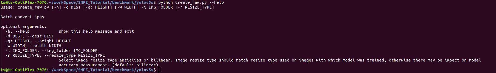
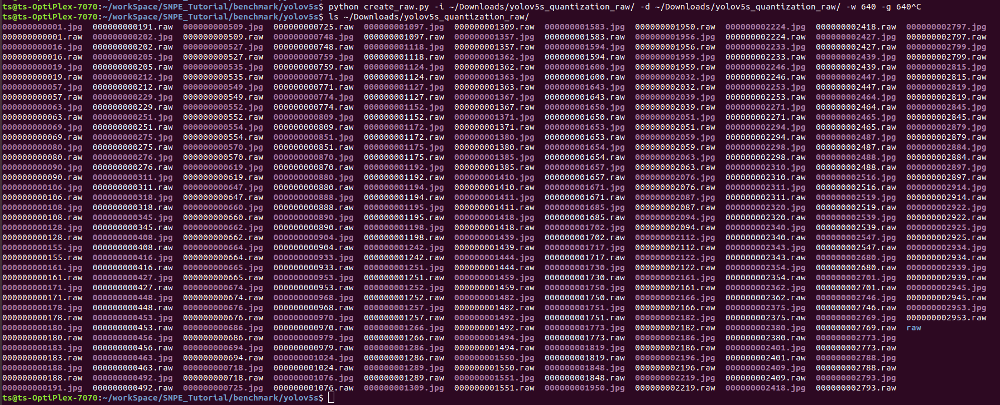

<!--
 * @Description: A tutorial of how to quantize an onnx format model(YOLOv5s) to dlc.
 * @version: 
 * @Author: RicardoLu <sheng.lu@thundercomm.com>
 * @Date: 2023-02-25 10:59:18
 * @LastEditors: Ricardo Lu
 * @LastEditTime: 2023-02-25 11:50:21
-->
## Model Quantize

所有`snpe-framework-to-dlc`转换工具转换出的模型都是非量化的，根据[Quantized vs Non-Quantized Models](https://developer.qualcomm.com/sites/default/files/docs/snpe/quantized_models.html)中Summary章节对Runtime的描述中可以知道，非量化模型只能跑CPU/GPU/DSP Runtime，跑不了AIP Runtime，另外就是非量化模型跑DSP Runtime时，Runtime会在初始化模型阶段做量化，但由runtime做的量化效果是不如常规的量化模型的。

:warning: 注：SNPE1支持非量化模型跑DSP Runtime，根据[SNPE1 to SNPE2 Migration Guide](https://developer.qualcomm.com/sites/default/files/docs/snpe/snpe2_migration_guidelines.html)中SDK Behavior/Content Changes的Runtime Changes小节可知SNPE2的DSP Runtime只支持量化模型！

SNPE提供了`snpe-dlc-quantize`工具用于量化模型，量化命令如下：

```shell
snpe-dlc-quantize --input_dlc yolov5s_v2.5.dlc --input_list image_file_list.txt
                  --output_dlc yolov5s_v2.5_quantized.dlc
```

:warning:注：SNPE2将`snpe-dlc-quantize`拆分成了`snpe-dlc-quant`和`snpe-dlc-graph-prepare`，前者功能和`snpe-dlc-quantize`一致，后者实际应用暂未明确。

## Input data for quantization

从量化命令可以看出，我们只需要准备好统一格式的raw输入即可完成量化，根据官方描述可知5-10个输入数据就足够了，但这只能够满足快速验证的需求。为了获得更稳健的量化结果，SNPE官方建议为给定的模型用例提供50-100个代表性输入数据示例，而不使用来自训练集的数据。代表性输入数据集理想地应包括表示/产生模型的所有输出类型/类别的所有输入数据模态，优选地每个输出类型/类具有几个输入数据示例。

:nerd_face:注：测试结果表明对于检测模型，提供总计超过200个具有代表性的输入数据时能得到一个不错的量化结果。例如yolov5s支持80个类，那么每个类提供3个即可，假如时单目标检测，那么就得针对这一个目标准备200个输入数据。

:warning:注：量化数据集在一定程度上会影响到量化模型的检测结果（类似于过耦合），以单目标检测模型为例，假如你的量化数据全都是一个场景，那么可能量化模型在这个场景下的检测准确率会更高，在其他场景下的检测准确率会更低。

本教程提供了一个[create_raw.py](../benchmark/yolov5s/create_raw.py)用于完成raw图片的生成：



```python
python create_raw.py -i ~/Downloads/yolov5s_quantization_raw/ -d ~/Downloads/yolov5s_quantization_raw/ -w 640 -g 640
```

:warning:注：Netron暂时不支持预览SNPE2转换出来的模型，目前只能用`snpe-dlc-info`来查看dlc模型信息。

`create_raw.py`脚本会先将`-i`参数设置的目录下的所有`.jpg`格式的图片先等比较缩放至`-w`和`-g`参数设置的宽高，再转换成raw，放到`-d`参数设置的目录下。



在Ubuntu系统下可以使用命令将所有的raw的绝对路径写入到一个`raw_lists.txt`中：

```shell
ls /home/ts/Downlodas/yolov5s_quantization_raw/*.raw > raw_lists.txt
```

至此就完成了量化模型所需的数据准备，可以开始运行`snpe-dlc-quantize`工具完成模型量化了。

:warning:注：如果想要支持AIP Runtime，那么还需要使用`--enable_hta`参数，但是按照高通目前的规划，在8Gen1系列的CPU开始弃用了AIP架构，统一和入了DSP，并改称为QNN。
