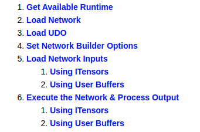
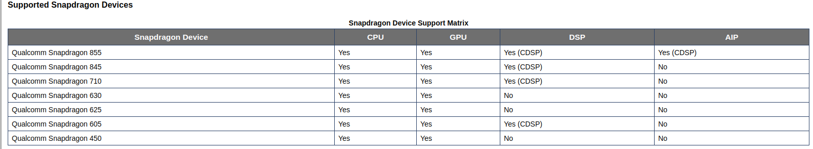
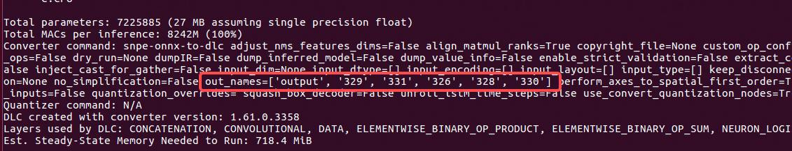
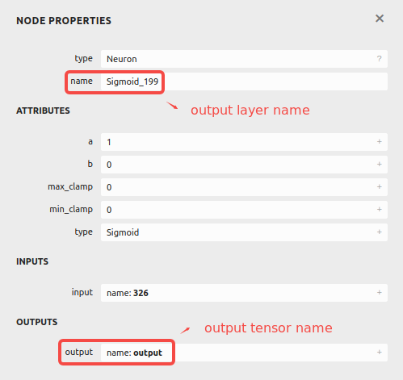
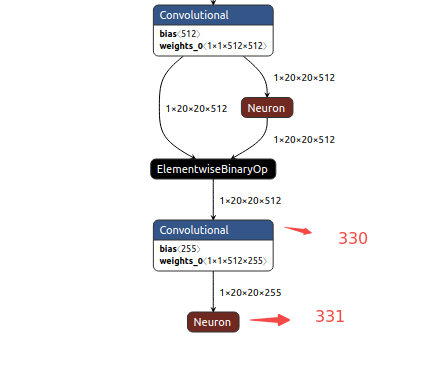

<!--
 * @Description: An simple inference developed on SNPE.
 * @version: 2.0
 * @Author: Ricardo Lu<shenglu1202@163.com>
 * @Date: 2022-07-09 11:35:20
 * @LastEditors: Ricardo Lu
 * @LastEditTime: 2022-07-11 20:09:36
-->
# Inference SDK——SNPETask

## Overview

根据[SNPE C++ Tutorial - Build the Sample](https://developer.qualcomm.com/sites/default/files/docs/snpe/cplus_plus_tutorial.html)，一个基础的Inference SDK应包含下图所示内容：



这部分内容对所有的模型而言是一致且透明的，通常不会因为模型的变化变化，`snpetask/SNPETask.cpp`的正是这部分内容的封装，这篇文档将对这几个流程进行完整的阐述。

## Get Available Runtime

在进行runtime检查之前`SNPETask`首先在构造函数里调用了SNPE的接口检查了库的版本信息，作为一个基本检查：

```c++
SNPETask::SNPETask()
{
    static zdl::DlSystem::Version_t version = zdl::SNPE::SNPEFactory::getLibraryVersion();
    LOG_INFO("Using SNPE: {}", version.asString().c_str());
}
```

例如我使用的是snpe-1.61.0.3358版本，那么在运行测试程序时会首先输出如下log:

```shell
2022-07-09 08:43:11.583927 <thread 32506> [info] [/home/tc-eb5/local/SNPETask/snpetask/SNPETask.cpp:67] [SNPETask] Using SNPE: 1.61.0.3358
```

由于在实现过程中为了对上层应用屏蔽SNPE相关的实现细节，我在`utility/utils.h`中声明了一个枚举类型的`runtime_t`，用于作为runtime参数，而在`SNPETask::init()`首先会对传入的`runtime_t`做switch-case选择。

```c++
bool SNPETask::init(const std::string& model_path, const runtime_t runtime)
{
    switch (runtime) {
        case CPU:
            m_runtime = zdl::DlSystem::Runtime_t::CPU;
            break;
        case GPU:
            m_runtime = zdl::DlSystem::Runtime_t::GPU;
            break;
        case GPU_16:
            m_runtime = zdl::DlSystem::Runtime_t::GPU_FLOAT16;
            break;
        case DSP:
            m_runtime = zdl::DlSystem::Runtime_t::DSP;
            break;
        case AIP:
            m_runtime = zdl::DlSystem::Runtime_t::AIP_FIXED8_TF;
            break;
        default:
            m_runtime = zdl::DlSystem::Runtime_t::CPU;
            break;
    }

    if (!zdl::SNPE::SNPEFactory::isRuntimeAvailable(m_runtime)) {
        LOG_ERROR("Selected runtime not present. Falling back to CPU.");
        m_runtime = zdl::DlSystem::Runtime_t::CPU;
    }
}
```

在这里我将自定义的`runtime_t`转换成了SNPE能够处理的`zdl::DlSystem::Runtime_t`，并且调用相应的接口检查当前平台是否支持用户设置的runtime。SNPE支持的runtime与平台相关，官方给出了部分型号SOC支持的runtime list：



runtime的细节需要了解平台所用SOC的datasheet，需要相关的硬件和驱动支持，但通常来说CPU和GPU（Adreno）是能够正常运行的，所以SNPETask在检测到runtime不支持的情况下回将runtime设为CPU。

注：可以使用`snpe-net-run`工具来快速验证runtime是否可用。

## Load Network

```c++
bool SNPETask::init(const std::string& model_path, const runtime_t runtime)
{
    m_container = zdl::DlContainer::IDlContainer::open(model_path);
}
```

加载模型的工作相对简单，只用调用相应的接口，将DLC绝对路径传进去就会自动解析DLC获得网络基本信息。

注：DLC(Deep Learning Contianer)，顾名思义只是深度学习网络的一个容器。

## Set Network Builder Options

```c++
bool SNPETask::init(const std::string& model_path, const runtime_t runtime)
{
    // ...
    m_snpe = snpeBuilder.setOutputLayers(m_outputLayers)
       .setRuntimeProcessorOrder(m_runtime)
       .setPerformanceProfile(profile)
       .setUseUserSuppliedBuffers(true)
       .setCPUFallbackMode(true)
       .build();
    
    if (nullptr == m_snpe.get()) {
        const char* errStr = zdl::DlSystem::getLastErrorString();
        LOG_ERROR("SNPE build failed: {}", errStr);
        return false;
    }
    // ...
}
```

### setCPUFallbackMode()

`setCPUFallbackMode(true)`这个选项是默认启用的，它用于将runtime不支持的layers回退到CPU上，避免运行错误。

注：`setCPUFallbackMode()`选项即将被删除，建议使用`setRuntimeProcessorOrder()`替代。

### setOutputLayers()

在构造`std::unique_ptr<zdl::SNPE::SNPE>`时，调用了[setOutputLayers()](https://developer.qualcomm.com/sites/default/files/docs/snpe/group__c__plus__plus__apis.html#a5aa93979416b17df898cb0c6f8425461)来设置当前模型的输出层，这其实意味着SNPE能够获取整个推理过程中任意一层网络的输出，但前提是你进行了相应的设置。并且这个设置是**必须的**，假如你没设置具体的输出层，那么默认会使用模型的最后一层作为输出，单输出层的网络可以使用默认，但是像Yolo网络它通常有三个输出层，显然不能仅依靠默认行为。

这也是为什么在`src/TSYolov5Imple.cpp`的`TSObjectDetectionImpl::Initialize`中先调用了`m_task->setOutputLayers(m_outputLayers)`再调用`m_task->init(model_path, runtime)`。

模型的输出层可以使用`snpe-dlc-info`工具和netron工具获得，下图是`snpe-dlc-info -i yolov5s.dlc`的输出：



可以看到`snpe-dlc-info`识别出了模型的六个output tensors，我们可以使用netron解析dlc模型，并搜索这六个output tensors对应的output layers。



这里snpe识别出了`yolov5s.onnx`的六个output tensors，但上文提到yolov5系列网络只有三个输出层，这个与具体模型相关，假如我们具体去看这六个output tensors，会发现该其实这六个output tensors对应着两组输出：



如上图所示，`331`实际是`330`的下一层，并且`331`这一层是sigmoid激活层，而sigmoid运算在实现上并不困难。这意味着我们其实可以选取`[output，329，331]`这三层作为输出层，也可以选择`[326，328，330]`三层作为输出层，只是假如我们选择后者，那么我们需要在后处理中手动对每一个输出数据做一次sigmoid运算。

注1：[setOutputTensors()](https://developer.qualcomm.com/sites/default/files/docs/snpe/group__c__plus__plus__apis.html#ad792b99cc17e500c1da28ff49572fdc2)与[setOutputLayers()](https://developer.qualcomm.com/sites/default/files/docs/snpe/group__c__plus__plus__apis.html#a5aa93979416b17df898cb0c6f8425461)效果相同，两个设置一个即可。

注2：SNPE的其他Builder Options含义可阅读[zdl::SNPE::SNPEBuilder](https://developer.qualcomm.com/sites/default/files/docs/snpe/group__c__plus__plus__apis.html#classzdl_1_1SNPE_1_1SNPEBuilder)。

## ITensors & UesrBuffers

ITensors和UserBuffers是两种内存类型，ITensors对应的就是User Space的普通memory(例如说malloc/new申请的内存)，UserBuffer则对应着DMA(ION内存)，在使用上两者最明显的差距就是ITensors比UserBuffers多一次`std::copy`（具体可以看[SNPE C++ Tutorial - Build the Sample](https://developer.qualcomm.com/sites/default/files/docs/snpe/cplus_plus_tutorial.html)）。

关于DMA，SNPE将有关内存管理的代码做了封装，因此只需要调用相关接口使用即可。在`snpetask/SNPETask.cpp`的实现中使用了UserBuffer，我们为每一个输入层和输出层申请了对应大小的ION Buffer用于存储输入图像数据和前向推理的输出数据，并将所有的ION Buffer的user space内存首地址存储在两个哈希表`m_inputTensors`和`m_outputTensors`中方便`src/TSYolov5Imple.cpp`在前后处理时进行索引（`getInputTensor`和`getOutputTensor`）。

```c++
static void createUserBuffer(zdl::DlSystem::UserBufferMap& userBufferMap,
                      std::unordered_map<std::string, float*>& applicationBuffers,
                      std::vector<std::unique_ptr<zdl::DlSystem::IUserBuffer>>& snpeUserBackedBuffers,
                      const zdl::DlSystem::TensorShape& bufferShape,
                      const char* name,
                      float* buffer)
{
    // Calculate the stride based on buffer strides, assuming tightly packed.
    // Note: Strides = Number of bytes to advance to the next element in each dimension.
    // For example, if a float tensor of dimension 2x4x3 is tightly packed in a buffer of 96 bytes, then the strides would be (48,12,4)
    // Note: Buffer stride is usually known and does not need to be calculated.
    std::vector<size_t> strides(bufferShape.rank());
    strides[strides.size() - 1] = sizeof(float);
    size_t stride = strides[strides.size() - 1];
    for (size_t i = bufferShape.rank() - 1; i > 0; i--)
    {
        stride *= bufferShape[i];
        strides[i-1] = stride;
    }
    // const size_t bufferElementSize = sizeof(float);
    size_t bufSize = calcSizeFromDims(bufferShape.getDimensions(), bufferShape.rank(), 1);
    buffer = new float[bufSize];

    // set the buffer encoding type
    zdl::DlSystem::UserBufferEncodingFloat userBufferEncodingFloat;
    // create user-backed storage to load input data onto it
    applicationBuffers.emplace(name, buffer);
    // create SNPE user buffer from the user-backed buffer
    zdl::DlSystem::IUserBufferFactory& ubFactory = zdl::SNPE::SNPEFactory::getUserBufferFactory();
    snpeUserBackedBuffers.push_back(ubFactory.createUserBuffer(applicationBuffers.at(name),
                                                                bufSize,
                                                                strides,
                                                                &userBufferEncodingFloat));
    // add the user-backed buffer to the inputMap, which is later on fed to the network for execution
    userBufferMap.add(name, snpeUserBackedBuffers.back().get());
}

bool SNPETask::init(const std::string& model_path, const runtime_t runtime)
{
    // get input tensor names of the network that need to be populated
    const auto& inputNamesOpt = m_snpe->getInputTensorNames();
    if (!inputNamesOpt) throw std::runtime_error("Error obtaining input tensor names");
    const zdl::DlSystem::StringList& inputNames = *inputNamesOpt;
    m_inputTensorSize = inputNames.size();
    m_inputBuffers = (float **)malloc(m_inputTensorSize * sizeof(float*));
    int i = 0;
    // create SNPE user buffers for each application storage buffer
    for (const char* name : inputNames) {
        // get attributes of buffer by name
        auto bufferAttributesOpt = m_snpe->getInputOutputBufferAttributes(name);
        if (!bufferAttributesOpt) {
            LOG_ERROR("Error obtaining attributes for input tensor: %s", name);
            return false;
        }

        const zdl::DlSystem::TensorShape& bufferShape = (*bufferAttributesOpt)->getDims();
        std::vector<size_t> tensorShape;
        for (size_t j = 0; j < bufferShape.rank(); j++) {
            tensorShape.push_back(bufferShape[j]);
        }
        m_inputShapes.emplace(name, tensorShape);

        createUserBuffer(m_inputUserBufferMap, m_inputTensors, m_inputUserBuffers, bufferShape, name, m_inputBuffers[i++]);
    }

    // get output tensor names of the network that need to be populated
    const auto& outputNamesOpt = m_snpe->getOutputTensorNames();
    if (!outputNamesOpt) throw std::runtime_error("Error obtaining output tensor names");
    const zdl::DlSystem::StringList& outputNames = *outputNamesOpt;
    m_outputTensorSize = outputNames.size();
    m_outputBuffers = (float **)malloc(m_outputTensorSize * sizeof(float*));
    i = 0;
    // create SNPE user buffers for each application storage buffer
    for (const char* name : outputNames) {
        // get attributes of buffer by name
        auto bufferAttributesOpt = m_snpe->getInputOutputBufferAttributes(name);
        if (!bufferAttributesOpt) {
            LOG_ERROR("Error obtaining attributes for input tensor: %s", name);
            return false;
        }

        const zdl::DlSystem::TensorShape& bufferShape = (*bufferAttributesOpt)->getDims();
        std::vector<size_t> tensorShape;
        for (size_t j = 0; j < bufferShape.rank(); j++) {
            tensorShape.push_back(bufferShape[j]);
        }
        m_outputShapes.emplace(name, tensorShape);

        createUserBuffer(m_outputUserBufferMap, m_outputTensors, m_outputUserBuffers, bufferShape, name, m_outputBuffers[i++]);
    }
}
```

比如说`yolov5s.dlc`的输入层是`images`，输入尺寸是1x640x640x3的float32，那么在第一个循环运行完之后`m_inputUserBufferMap`的元素仅有一个：<"images"，m_inputTensors[0]>，并且`m_inputBuffers[0]`申请的buffer大小为1x640x640x3的float32。

输出层同理，`m_outputUserBufferMap`中的元素应该为：<"output", m_inputTensors[0]>，<"329", m_inputTensors[1]>，<"331", m_inputTensors[2]>。` m_inputTensors[0]`为1x80x80x255的float32，` m_inputTensors[1]`为1x40x40x255的float32，` m_inputTensors[2]`为1x20x20x255的float32。

注：关于ION Buffer的使用可以阅读[ION Memory Control](https://ricardolu.gitbook.io/trantor/ion-memory-control)。

## execute

推理接口的调用相对简单，当用户将准备好的输入数据放入`m_inputTensors[0]`之后，直接调用：

```c++
bool SNPETask::execute()
{
    if (!m_snpe->execute(m_inputUserBufferMap, m_outputUserBufferMap)) {
        LOG_ERROR("SNPETask execute failed: %s", zdl::DlSystem::getLastErrorString());
        return false;
    }

    return true;
}
```

SNPE会自动将输出数据放入` m_inputTensors[0]`，` m_inputTensors[1]`，` m_inputTensors[2]`对应的内存buffer中，用户只需要从`m_outputUserBufferMap`中将其取出来再进行后处理即可。


至此，SNPETask的解析就到此为止，其余代码是一系列辅助性的getter接口，主要用于上层封装获取模型的基本信息和输入输出buffer首地址，代码并不复杂所以这里不再赘述，有兴趣的读者可以思考一下这种设计的易用性。