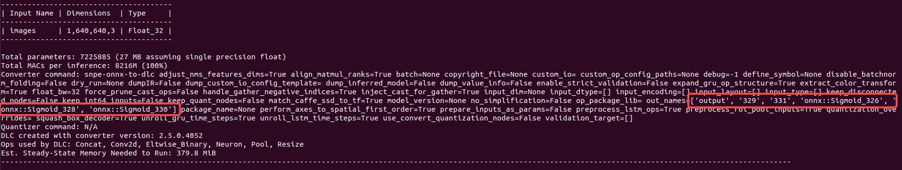
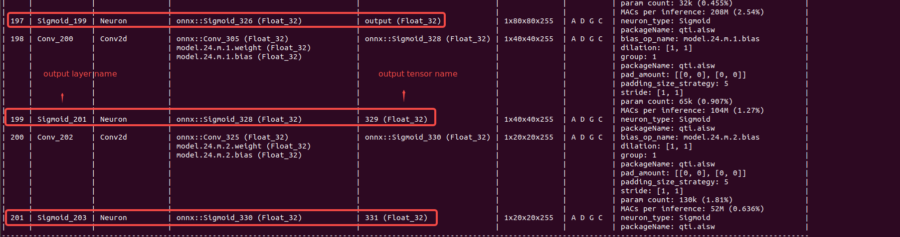

<!--
 * @Description: An simple inference developed on SNPE.
 * @version: 2.1
 * @Author: Ricardo Lu<shenglu1202@163.com>
 * @Date: 2022-07-09 11:35:20
 * @LastEditors: Ricardo Lu
 * @LastEditTime: 2022-07-11 20:09:36
-->
# Inference SDK——SNPETask

## Overview

根据[SNPE C++ Tutorial - Build the Sample](https://developer.qualcomm.com/sites/default/files/docs/snpe/cplus_plus_tutorial.html)，一个基础的Inference SDK应包含下图所示内容：


这部分内容对所有的模型而言是一致且透明的，通常不会因为模型的变化变化，`snpetask/SNPETask.cpp`的正是这部分内容的封装，这篇文档将对这几个流程进行完整的阐述。

## Get Available Runtime

在进行runtime检查之前`SNPETask`首先在构造函数里调用了SNPE的接口检查了库的版本信息，作为一个基本检查：

```c++
SNPETask::SNPETask()
{
    Snpe_DlVersion_Handle_t versionHandle = Snpe_Util_GetLibraryVersion();
    LOG_INFO("Using SNPE: {}", Snpe_DlVersion_ToString(versionHandle));
    Snpe_DlVersion_Delete(versionHandle);
}
```

例如我使用的是snpe-2.5.0.4052版本，那么在运行测试程序时会首先输出如下log:

```shell
2023-03-04 06:58:57.984925 <thread 17740> [info] [/home/tc-eb5/local/SNPE_Tutorial/snpetask/SNPETask.cpp:65] [SNPETask] Using SNPE: 2.5.0.4052
```

由于在实现过程中为了对上层应用屏蔽SNPE相关的实现细节，我在`utility/utils.h`中声明了一个枚举类型的`runtime_t`，用于作为runtime参数，而在`SNPETask::init()`首先会对传入的`runtime_t`做switch-case选择。

```c++
bool SNPETask::init(const std::string& model_path, const runtime_t runtime)
{
    switch (runtime) {
        case CPU:
            m_runtime = SNPE_RUNTIME_CPU;
            break;
        case GPU:
            m_runtime = SNPE_RUNTIME_GPU;
            break;
        case GPU_FLOAT16:
            m_runtime = SNPE_RUNTIME_GPU_FLOAT16;
            break;
        case DSP:
            m_runtime = SNPE_RUNTIME_DSP;
            break;
        case DSP_FIXED8:
            m_runtime = SNPE_RUNTIME_DSP_FIXED8_TF;
            break;
        case AIP:
            m_runtime = SNPE_RUNTIME_AIP_FIXED8_TF;
            break;
        default:
            m_runtime = SNPE_RUNTIME_CPU;
            break;
    }

    if (!Snpe_Util_IsRuntimeAvailable(m_runtime)) {
        LOG_ERROR("Selected runtime not supported. Falling back to CPU.");
        m_runtime = SNPE_RUNTIME_CPU;
    }
}
```

在这里我将自定义的`runtime_t`转换成了SNPE能够处理的`Snpe_Runtime_t`，并且调用相应的接口检查当前平台是否支持用户设置的runtime。SNPE支持的runtime与平台相关，官方给出了部分型号SOC支持的runtime list：


runtime的细节需要了解平台所用SOC的datasheet，需要相关的硬件和驱动支持，但通常来说CPU和GPU（Adreno）是能够正常运行的，所以SNPETask在检测到runtime不支持的情况下回将runtime设为CPU。

注：可以使用`snpe-net-run`工具来快速验证runtime是否可用。

## Load Network

```c++
bool SNPETask::init(const std::string& model_path, const runtime_t runtime)
{
    m_container = Snpe_DlContainer_Open(model_path.c_str());
}
```

加载模型的工作相对简单，只用调用相应的接口，将DLC绝对路径传进去就会自动解析DLC获得网络基本信息。

注：DLC(Deep Learning Contianer)，顾名思义只是深度学习网络的一个容器。

## Set Network Builder Options

```c++
bool SNPETask::init(const std::string& model_path, const runtime_t runtime)
{
    // ...
    Snpe_SNPEBuilder_Handle_t snpeBuilderHandle = Snpe_SNPEBuilder_Create(m_container);
    Snpe_PerformanceProfile_t profile = SNPE_PERFORMANCE_PROFILE_BURST;
    if (nullptr == m_runtimeList) m_runtimeList = Snpe_RuntimeList_Create();
    Snpe_RuntimeList_Add(m_runtimeList, m_runtime);
    Snpe_RuntimeList_Add(m_runtimeList, SNPE_RUNTIME_CPU);
    Snpe_SNPEBuilder_SetRuntimeProcessorOrder(snpeBuilderHandle, m_runtimeList);
    if (Snpe_SNPEBuilder_SetOutputLayers(snpeBuilderHandle, m_outputLayers)) {
        LOG_ERROR("Snpe_SNPEBuilder_SetOutputLayers failed: {}", Snpe_ErrorCode_GetLastErrorString());
        return false;
    }
    Snpe_SNPEBuilder_SetUseUserSuppliedBuffers(snpeBuilderHandle, true);
    Snpe_SNPEBuilder_SetPerformanceProfile(snpeBuilderHandle, profile);
    m_snpe = Snpe_SNPEBuilder_Build(snpeBuilderHandle);
    if (nullptr == m_snpe) {
        const char* errStr = Snpe_ErrorCode_GetLastErrorString();
        LOG_ERROR("SNPE build failed: {}", errStr);
        return false;
    }
    // ...
}
```

【注】：v2.5的SNPE由于使用C API，因此不再支持旧版C++ API中的链式函数。

### Snpe_RuntimeList_Add()

【注】：`setCPUFallbackMode()`选项被弃用，使用`setRuntimeProcessorOrder()`替代，因此现在runtime现在是一个list，实现上先将预期runtime添加进去，再另外添加一个`SNPE_RUNTIME_CPU`即可。

### Snpe_SNPEBuilder_SetOutputLayers()

在构造`Snpe_SNPE_Handle_t`时，调用了[Snpe_SNPEBuilder_SetOutputLayers()](https://developer.qualcomm.com/sites/default/files/docs/snpe/group__c__apis.html#gab4810af21701426011ca76df5416bb85)来设置当前模型的输出层，这其实意味着SNPE能够获取整个推理过程中任意一层网络的输出，但前提是你进行了相应的设置。并且这个设置是**必须的**，假如你没设置具体的输出层，那么默认会使用模型的最后一层作为输出，单输出层的网络可以使用默认，但是像Yolo网络它通常有三个输出层，显然不能仅依靠默认行为。

这也是为什么在`src/TSYolov5Imple.cpp`的`TSObjectDetectionImpl::Initialize`中先调用了`m_task->setOutputLayers(m_outputLayers)`再调用`m_task->init(model_path, runtime)`。

模型的输出层可以使用`snpe-dlc-info`工具和netron工具获得，下图是`snpe-dlc-info -i yolov5s.dlc`的输出：



可以看到`snpe-dlc-info`识别出了模型的六个output tensors，SNEP v2.5的输出和v1.61的略有不同，并且由于目前Netron不支持解析v2.5的dlc，因此目前只能通过`snpe-dlc-info`的输出去看：



注1：[Snpe_SNPEBuilder_SetOutputTensors()](https://developer.qualcomm.com/sites/default/files/docs/snpe/group__c__plus__plus__apis.html#ad792b99cc17e500c1da28ff49572fdc2)与[Snpe_SNPEBuilder_SetOutputLayers()](https://developer.qualcomm.com/sites/default/files/docs/snpe/group__c__plus__plus__apis.html#a5aa93979416b17df898cb0c6f8425461)效果相同，两个设置一个即可。

注2：SNPE的其他Builder Options含义可阅读[SNPE C API](https://developer.qualcomm.com/sites/default/files/docs/snpe/group__c__apis.html#ga243656df3511bc730ac165b930e3a780)。

## ITensors & UesrBuffers

ITensors和UserBuffers是两种内存类型，ITensors对应的就是User Space的普通memory(例如说malloc/new申请的内存)，UserBuffer则对应着DMA(ION内存)，在使用上两者最明显的差距就是ITensors比UserBuffers多一次`std::copy`（具体可以看[SNPE C Tutorial - Build the Sample](https://developer.qualcomm.com/sites/default/files/docs/snpe/c_tutorial.html)）。

关于DMA，SNPE将有关内存管理的代码做了封装，因此只需要调用相关接口使用即可。在`snpetask/SNPETask.cpp`的实现中使用了UserBuffer，我们为每一个输入层和输出层申请了对应大小的ION Buffer用于存储输入图像数据和前向推理的输出数据，并将所有的ION Buffer的user space内存首地址存储在两个哈希表`m_inputTensors`和`m_outputTensors`中方便`src/TSYolov5Imple.cpp`在前后处理时进行索引（`getInputTensor`和`getOutputTensor`）。

```c++
static void createUserBuffer(Snpe_UserBufferMap_Handle_t userBufferMapHandle,
                      std::unordered_map<std::string, std::vector<uint8_t>>& applicationBuffers,
                      std::vector<Snpe_IUserBuffer_Handle_t>& snpeUserBackedBuffersHandle,
                      Snpe_TensorShape_Handle_t bufferShapeHandle,
                      const char* name,
                      size_t bufferElementSize)
{
    // Calculate the stride based on buffer strides, assuming tightly packed.
    // Note: Strides = Number of bytes to advance to the next element in each dimension.
    // For example, if a float tensor of dimension 2x4x3 is tightly packed in a buffer of 96 bytes, then the strides would be (48,12,4)
    // Note: Buffer stride is usually known and does not need to be calculated.
    std::vector<size_t> strides(Snpe_TensorShape_Rank(bufferShapeHandle));
    strides[strides.size() - 1] = sizeof(float);
    size_t stride = strides[strides.size() - 1];
    for (size_t i = Snpe_TensorShape_Rank(bufferShapeHandle) - 1; i > 0; i--)
    {
        stride *= Snpe_TensorShape_At(bufferShapeHandle, i);
        strides[i - 1] = stride;
    }
    Snpe_TensorShape_Handle_t stridesHandle = Snpe_TensorShape_CreateDimsSize(strides.data(), Snpe_TensorShape_Rank(bufferShapeHandle));
    size_t bufSize = calcSizeFromDims(Snpe_TensorShape_GetDimensions(bufferShapeHandle), Snpe_TensorShape_Rank(bufferShapeHandle), bufferElementSize);
    LOG_INFO("Create [{}] buffer size: {}.", name, bufSize);
    // set the buffer encoding type
     Snpe_UserBufferEncoding_Handle_t userBufferEncodingFloatHandle = Snpe_UserBufferEncodingFloat_Create();
    // create user-backed storage to load input data onto it
    applicationBuffers.emplace(name, std::vector<uint8_t>(bufSize));
    // create SNPE user buffer from the user-backed buffer
    snpeUserBackedBuffersHandle.push_back(Snpe_Util_CreateUserBuffer(applicationBuffers.at(name).data(),
                                                  bufSize,
                                                  stridesHandle,
                                                  userBufferEncodingFloatHandle));
    // add the user-backed buffer to the inputMap, which is later on fed to the network for execution
    Snpe_UserBufferMap_Add(userBufferMapHandle, name, snpeUserBackedBuffersHandle.back());
    Snpe_UserBufferEncodingFloat_Delete(userBufferEncodingFloatHandle);
}

bool SNPETask::init(const std::string& model_path, const runtime_t runtime)
{
    // get input tensor names of the network that need to be populated
    Snpe_StringList_Handle_t inputNamesHandle = Snpe_SNPE_GetInputTensorNames(m_snpe);
    if (nullptr == inputNamesHandle) throw std::runtime_error("Error obtaining input tensor names");
    assert(Snpe_StringList_Size(inputNamesHandle) > 0);

    // create SNPE user buffers for each application storage buffer
    if (nullptr == m_inputUserBufferMap) m_inputUserBufferMap = Snpe_UserBufferMap_Create();
    for (size_t i = 0; i < Snpe_StringList_Size(inputNamesHandle); ++i) {
        const char* name = Snpe_StringList_At(inputNamesHandle, i);
        // get attributes of buffer by name
        auto bufferAttributesOptHandle = Snpe_SNPE_GetInputOutputBufferAttributes(m_snpe, name);
        if (nullptr == bufferAttributesOptHandle) {
            LOG_ERROR("Error obtaining attributes for input tensor: {}", name);
            return false;
        }

        auto bufferShapeHandle = Snpe_IBufferAttributes_GetDims(bufferAttributesOptHandle);
        std::vector<size_t> tensorShape;
        for (size_t j = 0; j < Snpe_TensorShape_Rank(bufferShapeHandle); j++) {
            tensorShape.push_back(Snpe_TensorShape_At(bufferShapeHandle, j));
        }
        m_inputShapes.emplace(name, tensorShape);

        // size_t bufferElementSize = Snpe_IBufferAttributes_GetElementSize(bufferAttributesOptHandle);
        createUserBuffer(m_inputUserBufferMap, m_inputTensors, m_inputUserBuffers, bufferShapeHandle, name, sizeof(float));

        Snpe_IBufferAttributes_Delete(bufferAttributesOptHandle);
        Snpe_TensorShape_Delete(bufferShapeHandle);
    }
    Snpe_StringList_Delete(inputNamesHandle);

    // get output tensor names of the network that need to be populated
    if (nullptr == m_outputUserBufferMap) m_outputUserBufferMap = Snpe_UserBufferMap_Create();
    Snpe_StringList_Handle_t outputNamesHandle = Snpe_SNPE_GetOutputTensorNames(m_snpe);
    if (nullptr == outputNamesHandle) throw std::runtime_error("Error obtaining input tensor names");
    assert(Snpe_StringList_Size(outputNamesHandle) > 0);

    // create SNPE user buffers for each application storage buffer
    for (size_t i = 0; i < Snpe_StringList_Size(outputNamesHandle); ++i) {
        const char* name = Snpe_StringList_At(outputNamesHandle, i);
        // get attributes of buffer by name
        auto bufferAttributesOptHandle = Snpe_SNPE_GetInputOutputBufferAttributes(m_snpe, name);
        if (!bufferAttributesOptHandle) {
            LOG_ERROR("Error obtaining attributes for input tensor: {}", name);
            return false;
        }

        auto bufferShapeHandle = Snpe_IBufferAttributes_GetDims(bufferAttributesOptHandle);
        std::vector<size_t> tensorShape;
        for (size_t j = 0; j < Snpe_TensorShape_Rank(bufferShapeHandle); j++) {
            tensorShape.push_back(Snpe_TensorShape_At(bufferShapeHandle, j));
        }
        m_outputShapes.emplace(name, tensorShape);

        // size_t bufferElementSize = Snpe_IBufferAttributes_GetElementSize(bufferAttributesOptHandle);
        createUserBuffer(m_outputUserBufferMap, m_outputTensors, m_outputUserBuffers, bufferShapeHandle, name, sizeof(float));

        Snpe_IBufferAttributes_Delete(bufferAttributesOptHandle);
        Snpe_TensorShape_Delete(bufferShapeHandle);
    }
}
```

比如说`yolov5s.dlc`的输入层是`images`，输入尺寸是1x640x640x3的float32，那么在第一个循环运行完之后`m_inputUserBufferMap`的元素仅有一个：<"images"，m_inputTensors[0]>，并且`m_inputBuffers[0]`申请的buffer大小为1x640x640x3的float32。

输出层同理，`m_outputUserBufferMap`中的元素应该为：<"output", m_inputTensors[0]>，<"329", m_inputTensors[1]>，<"331", m_inputTensors[2]>。` m_inputTensors[0]`为1x80x80x255的float32，` m_inputTensors[1]`为1x40x40x255的float32，` m_inputTensors[2]`为1x20x20x255的float32。

注：关于ION Buffer的使用可以阅读[ION Memory Control](https://ricardolu.gitbook.io/trantor/ion-memory-control)。

## execute

推理接口的调用相对简单，当用户将准备好的输入数据放入`m_inputTensors[0]`之后，直接调用：

```c++
bool SNPETask::execute()
{
    if (SNPE_SUCCESS != Snpe_SNPE_ExecuteUserBuffers(m_snpe, m_inputUserBufferMap, m_outputUserBufferMap)) {
        LOG_ERROR("SNPETask execute failed: {}", Snpe_ErrorCode_GetLastErrorString());
        return false;
    }

    return true;
}
```

SNPE会自动将输出数据放入` m_outputTensors[0]`，` m_outputTensors[1]`，` m_outputTensors[2]`对应的内存buffer中，用户只需要从`m_outputUserBufferMap`中将其取出来再进行后处理即可。


【注】：至此，SNPETask的解析就到此为止，其余代码是一系列辅助性的getter接口，主要用于上层封装获取模型的基本信息和输入输出buffer首地址。SNPE v2.5的C API和v1.61的C++ API最大的区别就是，C API不具有面向对象的设计，将C++中的所有类都改为了对应handle_t，不再由析构自动回收资源，所有的handle都需要用户自行回收。