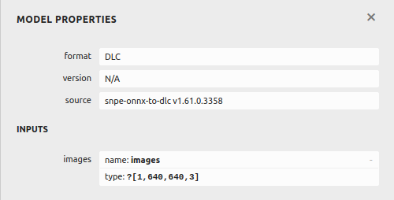
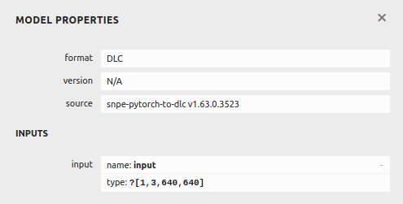

<!--

 * @Description: Pre/Post process of YOLOv5s.
 * @version: 2.0
 * @Author: Ricardo Lu<shenglu1202@163.com>
 * @Date: 2022-07-09 11:39:17
 * @LastEditors: Ricardo Lu
 * @LastEditTime: 2022-08-12 05:19:52
-->
# Encapsulation of YOLOv5s

## Overview

`libYOLOv5s.so`的实现是一个体现封装性的设计，在[SNPETask](./SNPETask.md)提到Inference SDK对大多数模型而言是通用的，不同的只有对模型输入输出数据的处理，这里我们称之为前/后处理，`YOLOv5sImpl.cpp`就负责这部分工作；并且在日常工程项目中，并不是所有人都需要关注算法处理的内部细节，因此我在`YOLOv5sImpl.cpp`之上封装了一层`YOLOv5s.cpp`，所有对外的接口都随其发布。

## Input Data

经过了模型转换和Inference SDK的开发，我们只需要准备好输入数据并将其传递给SNPE实例，并调用`execute()`就能完成对应的推理任务。但是需要注意的是**SNPE仅支持NHWC格式的输入数据**，因此我们在运行之前需要检查dlc的input layer的shape到底是什么样的。

依然可以使用netron工具，选中开头的输入层来查看input layer的信息： 



这是一个由onnx转换而来的dlc，它的type一栏显示了它的shape为`1x640x640x3`，这就是NHWC格式的shape，也恰好符合OpenCV的`cv::Mat`的格式。 



这是一个由pt转换而来的dlc，它的type一栏显示了它的shape为`1x3x640x640`，这是NCHW格式的shape，假如我们使用OpenCV完成了输入图像的读取，这时候的`cv::Mat`是NHWC格式的data，如果想要用这个dlc完成推理，我们首先需要把NHWC格式的数据转换为NCHW格式(这个地方存在一点矛盾，通常来说SNPE只支持NHWC的输入，转出来的模型应该默认是NHWC的，像这个NCHW的情况可以在转模型是通过指定`--input_layout`为NHWC解决，也可以自己手动实现一个从NHWC到NCHW的converter函数再推理，本文不做展开)。 

有关NHWC和NCHW数据格式在存储上的区别可以参考：

https://blog.csdn.net/chengyq116/article/details/112759824

https://developer.qualcomm.com/sites/default/files/docs/snpe/image_input.html 

## Initialize

```c++
bool ObjectDetectionImpl::Initialize(const std::string& model_path, const runtime_t runtime)
{
    m_task = std::move(std::unique_ptr<snpetask::SNPETask>(new snpetask::SNPETask()));

    m_inputLayers = config.inputLayers;
    m_outputLayers = config.outputLayers;
    m_outputTensors = config.outputTensors;
    m_labels = config.labels;
    m_grids = config.grids;

    m_task->setOutputLayers(m_outputLayers);

    if (!m_task->init(config.model_path, config.runtime)) {
        LOG_ERROR("Can't init snpetask instance.");
        return false;
    }

    m_output = new float[m_grids * m_labels];

    m_isInit = true;
    return true;
}
```

基础的初始化信息，主要是：

- 初始化SNPETask实例；
- 设置输出层的名称并传递给`SNPETask`；
- 申请用于后处理的内存。

### pre_process_t和post_process_t

对外暴露的两个`std::function`对象，用于用户传入自定义的前后处理函数，但这部分内容同时涉及到推理内存的管理，假如要启用的话，需要将用户空间(main线程)申请的内存作为推理内存，因此还需要进一步完善SDK才能使用。

## PrePrecess

在图像准备好之后，就可以将其传递给SNPE实例准备进行前向推理了，但是为了减少影响因素，除了图像的缩放，通常还会在推理之前做归一化处理：

```c++
bool ObjectDetectionImpl::PreProcess(const cv::Mat& image)
{
    auto inputShape = m_task->getInputShape(INPUT_TENSOR);

    size_t batch = inputShape[0];
    size_t inputHeight = inputShape[1];
    size_t inputWidth = inputShape[2];
    size_t channel = inputShape[3];

    if (m_task->getInputTensor(INPUT_TENSOR) == nullptr) {
        LOG_ERROR("Empty input tensor");
        return false;
    }

    cv::Mat input(inputHeight, inputWidth, CV_32FC3, m_task->getInputTensor(INPUT_TENSOR), inputWidth * channel);

    if (image.empty()) {
        LOG_ERROR("Invalid image!");
        return false;
    }

    int imgWidth = image.cols;
    int imgHeight = image.rows;

    m_scale = std::min(inputHeight /(float)imgHeight, inputWidth / (float)imgWidth);
    int scaledWidth = imgWidth * m_scale;
    int scaledHeight = imgHeight * m_scale;
    m_xOffset = (inputWidth - scaledWidth) / 2;
    m_yOffset = (inputHeight - scaledHeight) / 2;

    cv::Mat inputMat(inputHeight, inputWidth, CV_8UC3, cv::Scalar(128, 128, 128));
    cv::Mat roiMat(inputMat, cv::Rect(m_xOffset, m_yOffset, scaledWidth, scaledHeight));
    cv::resize(image, roiMat, cv::Size(scaledWidth, scaledHeight), cv::INTER_LINEAR);

    inputMat.convertTo(input, CV_32FC3);
    input /= 255.0f;

}
```

前处理核心在于通过`getInputTensor()`接口获取输入层的UserBuffer的首地址，并把传入的图像拷贝至这个地址

## PostPrecess

根据网络不同前向传播输出的数据也有所不同，但对于大多数的应用场景来说，主要有landmark和confidence信息。这两类信息已经是推理的最终结果，但是对于普通用户来说它并不是一种可视化的信息，所以我们需要对这些输出做一定的解析——这一步通常被称为后处理。 

对于python来说，由于存在一些库，所以对于高维矩阵数据的操作变得非常简单，可以直接整体操作某一维度的整个list，而对于C++来说由于没有这些库的帮助，所以对于矩阵的操作，就只能通过一层层的for循环来完成。后处理的操作通常来说也就是把python代码翻译成C++代码的过程，为了方便操作其实会做一些数据拷贝。

```c++
bool TSObjectDetectionImpl::PostProcess(std::vector<ObjectData> &results)
{
    // copy all outputs to one array.
    // [3 * 80 * 80 * 25]----\
    // [3 * 40 * 40 * 25]--------> [25200 * 25]
    // [3 * 20 * 20 * 25]----/
    float* tmpOutput = m_output;
    for (size_t i = 0; i < 3; i++) {
        auto outputShape = m_task->getOutputShape(m_outputTensors[i]);
        const float *predOutput = m_task->getOutputTensor(m_outputTensors[i]);

        int batch = outputShape[0];
        int channels = outputShape[1];
        int height = outputShape[2];
        int width = outputShape[3];
        int probabilities = outputShape[4];

        for (int l = 0; l < channels; l++) {   // 3
            for (int j = 0; j < height; j++) {      // 80/40/20
                for (int k = 0; k < width; k++) {   // 80/40/20
                    int anchorIdx = l * 2;
                    for (int m = 0; m < probabilities; m++) {     // 25
                        if (m < 2) {
                            float value = sigmoid(*predOutput);
                            float gridValue = m == 0 ? k : j;
                            *tmpOutput = (value * 2 - 0.5 + gridValue) * strides[i];
                        } else if (m < 4) {
                            float value = sigmoid(*predOutput);
                            *tmpOutput = value * value * 4 * anchorGrid[i][anchorIdx++];
                        } else {
                            *tmpOutput = sigmoid(*predOutput);
                        }
                        tmpOutput++;
                        predOutput++;
                    }
                }
            }
        }
    }
    // ...
}
```

如注释所示，这个这五层for循环就是将`tymx_onnx.dlc`的三个输出层每个像素的输出信息合并到一个一维数组的过程。

合并到一个一位数组之后我们就能按照固定的步长去取得我们想要的bbox坐标和probabilities，并经过一系列运算将其还原至输入图像尺寸，用于前端展示。

```c++
bool ObjectDetectionImpl::PostProcess(std::vector<ObjectData> &results)
{
    std::vector<int> boxIndexs;
    std::vector<float> boxConfidences;
    std::vector<ObjectData> winList;

    for (int i = 0; i< MODEL_OUTPUT_GRIDS; i++) {   // 共计MODEL_OUTPUT_GRIDS个grid要统计
        // 每个grid有MODEL_OUTPUT_CHANNEL个数据要处理
        // MODEL_OUTPUT_CHANNEL = 85 ----> [bbox_x, bbox_y, bbox_width, bbox_height, bbox_score, prob0, prob1,..., prob84]
        float boxConfidence = m_output[i * MODEL_OUTPUT_CHANNEL + 4];
        if (boxConfidence > 0.001) {
            boxIndexs.push_back(i);     // 先对bbox进行粗筛，并保存索引index
            boxConfidences.push_back(boxConfidence);
        }
    }

    float curMaxScore = 0.0f;
    float curMinScore = 0.0f;

    for (size_t i = 0; i < boxIndexs.size(); i++) {
        int curIdx = boxIndexs[i];
        float curBoxConfidence = boxConfidences[i];

        for (int j = 5; j < MODEL_OUTPUT_CHANNEL; j++) {    // 处理目标分类概率即MODEL_OUTPUT_CHANNEL中的[prob0, prob1,..., prob84]
            float score = curBoxConfidence * m_output[curIdx * MODEL_OUTPUT_CHANNEL + j];
            if (score > m_confThresh) {
                ObjectData rect;
                rect.bbox.width = m_output[curIdx * MODEL_OUTPUT_CHANNEL + 2];
                rect.bbox.height = m_output[curIdx * MODEL_OUTPUT_CHANNEL + 3];
                rect.bbox.x = std::max(0, static_cast<int>(m_output[curIdx * MODEL_OUTPUT_CHANNEL] - rect.bbox.width / 2)) - m_xOffset;
                rect.bbox.y = std::max(0, static_cast<int>(m_output[curIdx * MODEL_OUTPUT_CHANNEL + 1] - rect.bbox.height / 2)) - m_yOffset;

                rect.bbox.width /= m_scale;
                rect.bbox.height /= m_scale;
                rect.bbox.x /= m_scale;
                rect.bbox.y /= m_scale;
                rect.confidence = score;
                rect.label = j - 5;

                winList.push_back(rect);
            }
        }
    }

    winList = nms(winList, m_nmsThresh);

    for (size_t i = 0; i < winList.size(); i++) {
        if (winList[i].bbox.width >= m_minBoxBorder || winList[i].bbox.height >= m_minBoxBorder) {
            if (!m_roi.empty()) {
                winList[i].bbox.x += m_roi.x;
                winList[i].bbox.y += m_roi.y;
            }
            results.push_back(winList[i]);
        }
    }

    return true;
}
```

